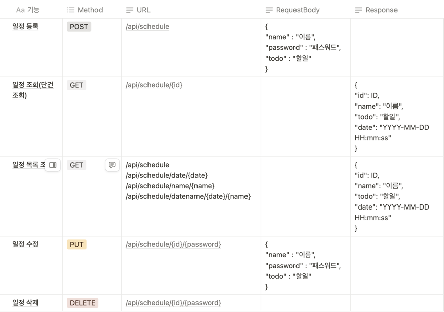
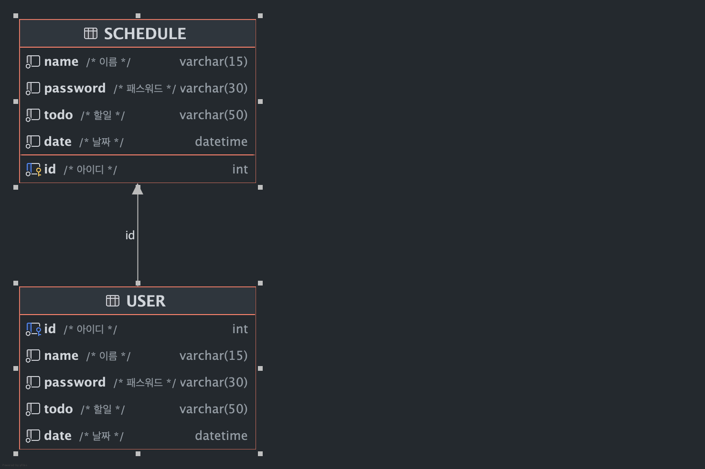

# **1. API명세 작성**

# **2. ERD 작성**

# **3. 프로젝트 소개**

## 3️⃣ **필수 기능 가이드**

### Lv 1. API 명세 및 ERD 작성   `필수`

- [ ]  **API 명세서 작성하기**
    - [ ]  API명세서는 프로젝트 root(최상위) 경로의 `README.md` 에 작성
    - 참고) API 명세서 작성 가이드
        - API 명세서란 API명, 요청 값(파라미터), 반환 값, 인증/인가 방식, 데이터 및 전달 형식 등 API를 정확하게 호출하고 그 결과를 명확하게 해석하는데 필요한 정보들을 일관된 형식으로 기술한 것을 의미합니다.
        - request 및 response는 [json(링크)](https://namu.wiki/w/JSON) 형태로 작성합니다.

- [ ]  **ERD 작성하기**
    - [ ]  ERD는 프로젝트 root(최상위) 경로의 `README.md` 에 첨부
    - 참고) ERD 작성 가이드

        - API 명세 작성을 통해 서비스의 큰 흐름과 기능을 파악 하셨다면 이제는 기능을 구현하기 위해 필요한 데이터가 무엇인지 생각해봐야합니다.
            - 이때, 구현해야 할 서비스의 영역별로 필요한 데이터를 설계하고 각 영역간의 관계를 표현하는 방법이 있는데 이를 ERD(Entity Relationship Diagram)라 부릅니다.
        - ERD 작성간에 다음과 같은 항목들을 학습합니다.
            - E(Entity. 개체)
                - 구현 할 서비스의 영역에서 필요로 하는 데이터를 담을 개체를 의미합니다.
                    - ex) `책`, `저자`, `독자`, `리뷰`
            - A(Attribute. 속성)
                - 각 개체가 가지는 속성을 의미합니다.
                    - ex) 책은 `제목`, `언어`, `출판일`, `저자`, `가격` 등의 속성을 가질 수 있습니다.
            - R(Relationship. 관계)
                - 개체들 사이의 관계를 정의합니다.
                    - ex) `저자`는 여러 권의 `책`을 집필할 수 있습니다. 이때, 저자와 책의 관계는 일대다(1:N) 관계입니다.

- [ ]  **SQL 작성하기**
    - [ ]  설치한 데이터베이스(Mysql)에 ERD를 따라 테이블을 생성
    - 참고) SQL 작성 가이드
        - 과제 프로그램의 root(최상위) 경로에`schedule.sql` 파일을 만들고, 테이블 생성에 필요한 query를 작성하세요.

### Lv 2. 일정 생성 및 조회  `필수`

- [ ]  **일정 생성(일정 작성하기)**
    - [ ]  일정 생성 시, 포함되어야할 데이터
        - [ ]  `할일`, `작성자명`, `비밀번호`, `작성/수정일`을 저장
        - [ ]  `작성/수정일`은 날짜와 시간을 모두 포함한 형태
    - [ ]  각 일정의 고유 식별자(ID)를 자동으로 생성하여 관리
    - [ ]  최초 입력 시, 수정일은 작성일과 동일
   
- [ ]  **전체 일정 조회(등록된 일정 불러오기)**
    - [ ]  다음 조건을 바탕으로 등록된 일정 목록을 전부 조회
        - [ ]  `수정일` (형식 : YYYY-MM-DD)
        - [ ]  `작성자명`
    - [ ]  조건 중 한 가지만을 충족하거나, 둘 다 충족을 하지 않을 수도, 두 가지를 모두 충족할 수도 있습니다.
    - [ ]  `수정일` 기준 내림차순으로 정렬하여 조회
   
- [ ]  **선택 일정 조회(선택한 일정 정보 불러오기)**
    - [ ]  선택한 일정 단건의 정보를 조회할 수 있습니다.
    - [ ]  일정의 고유 식별자(ID)를 사용하여 조회합니다.

### Lv 3. 일정 수정 및 삭제  `필수`

- [ ]  **선택한 일정 수정**
    - [ ]  선택한 일정 내용 중 `할일`, `작성자명` 만 수정 가능
        - [ ]  서버에 일정 수정을 요청할 때 `비밀번호`를 함께 전달합니다.
        - [ ]  `작성일` 은 변경할 수 없으며, `수정일` 은 수정 완료 시, 수정한 시점으로 변경합니다.
- [ ]  **선택한 일정 삭제**
    - [ ]  선택한 일정을 삭제할 수 있습니다.
        - [ ]  서버에 일정 수정을 요청할 때 `비밀번호`를 함께 전달합니다.

---

### Lv 2. 일정 생성 및 조회  `필수`

- [ ]  **일정 생성(일정 작성하기)**
    - [ ]  일정 생성 시, 포함되어야할 데이터
        - [ ]  `할일`, `작성자명`, `비밀번호`, `작성/수정일`을 저장
        - [ ]  `작성/수정일`은 날짜와 시간을 모두 포함한 형태
    - [ ]  각 일정의 고유 식별자(ID)를 자동으로 생성하여 관리
    - [ ]  최초 입력 시, 수정일은 작성일과 동일

- [ ]  **전체 일정 조회(등록된 일정 불러오기)**
    - [ ]  다음 조건을 바탕으로 등록된 일정 목록을 전부 조회
        - [ ]  `수정일` (형식 : YYYY-MM-DD)
        - [ ]  `작성자명`
    - [ ]  조건 중 한 가지만을 충족하거나, 둘 다 충족을 하지 않을 수도, 두 가지를 모두 충족할 수도 있습니다.
    - [ ]  `수정일` 기준 내림차순으로 정렬하여 조회

- [ ]  **선택 일정 조회(선택한 일정 정보 불러오기)**
    - [ ]  선택한 일정 단건의 정보를 조회할 수 있습니다.
    - [ ]  일정의 고유 식별자(ID)를 사용하여 조회합니다.

### Lv 3. 일정 수정 및 삭제  `필수`

- [ ]  **선택한 일정 수정**
    - [ ]  선택한 일정 내용 중 `할일`, `작성자명` 만 수정 가능
        - [ ]  서버에 일정 수정을 요청할 때 `비밀번호`를 함께 전달합니다.
        - [ ]  `작성일` 은 변경할 수 없으며, `수정일` 은 수정 완료 시, 수정한 시점으로 변경합니다.
- [ ]  **선택한 일정 삭제**
    - [ ]  선택한 일정을 삭제할 수 있습니다.
        - [ ]  서버에 일정 수정을 요청할 때 `비밀번호`를 함께 전달합니다.

---

## 4️⃣ 도전 기능 가이드

### Lv 4. 연관 관계 설정  `도전`

- [ ]  **작성자와 일정의 연결**
    - [ ]  설명
        - [ ]  동명이인의 작성자가 있어 어떤 작성자가 등록한 ‘할 일’인지 구별할 수 없음
        - [ ]  작성자를 식별하기 위해 이름으로만 관리하던 작성자에게 고유 식별자를 부여합니다.
        - [ ]  작성자 테이블을 생성하고 일정 테이블에 FK를 생성해 연관관계를 설정해 봅니다.
    - [ ]  조건
        - [ ]  작성자는 `이름` 외에 `이메일`, `등록일`, `수정일` 정보를 가지고 있습니다.
            - [ ]  작성자의 정보는 추가로 받을 수 있습니다.(조건만 만족한다면 다른 데이터 추가 가능)
        - [ ]  고유 식별자를 통해 작성자를 조회할 수 있도록 기존 코드를 변경합니다.
        - [ ]  작성자의 고유 식별자가 일정 테이블의 외래키가 될 수 있도록 합니다.

### Lv 5. 페이지네이션  `도전`

- [ ]  설명
    - [ ]  많은 양의 데이터를 효율적으로 표시하기 위해 데이터를 여러 페이지로 나눕니다.
        - [ ]  `페이지 번호`와 `페이지 크기`를 쿼리 파라미터로 전달하여 요청하는 항목을 나타냅니다.
        - [ ]  전달받은 페이지 번호와 크기를 기준으로 쿼리를 작성하여 필요한 데이터만을 조회하고 반환
- [ ]  조건
    - [ ]  등록된 일정 목록을 `페이지 번호`와 `크기`를 기준으로 모두 조회
    - [ ]  조회한 일정 목록에는 `작성자 이름`이 포함
    - [ ]  범위를 넘어선 페이지를 요청하는 경우 빈 배열을 반환
    - [ ]  Paging 객체를 활용할 수 있음